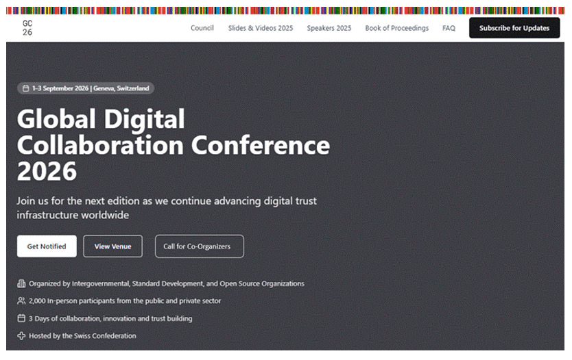

**Public Announcement Thursday, December 18, 2025, 9 CET**

**[globaldigitalcollaboration.org 2](#globaldigitalcollaboration.org)**

[Amendments to homepage	2](#amendments-to-homepage)
[Content for Council-page 3](#content-for-council-page)
[Content for Council subpage 5](#content-for-council-subpage)
[Content for Subpage: Call for Co-Organizers 6](#content-for-subpage:-call-for-co-organizers)
[Terms of Reference	8](#terms-of-reference)

[**LinkedIn post (Draft, to be polished) 11**](#linkedin-post)

# globaldigitalcollaboration.org {#globaldigitalcollaboration.org}

## Amendments to homepage {#amendments-to-homepage}

* One additional tab: “Council”  
* One additional CTA-button: “Call for Co-Organizers”  
* Book of Proceedings (PDF provided separately)

--- 

## Content for Council-page {#content-for-council-page}

**Council**

The GDC Council advances dialogue to support trusted and interoperable digital infrastructure—including wallets, credentials, payment systems, and the use of cybersecurity and AI in these contexts—by bringing together UN Member States, companies, Intergovernmental Organizations (IGOs), and Non-Governmental Organizations (NGOs). Council members are expected to provide independent, non-binding advice to the GDC on the following matters:

* Overall strategy, priorities, and guidance  
* Nominating co-organizers for the GDC Conference  
* Proposing agenda items for the GDC Conference and the High-Level Meeting  
* Discussing the annual budget and fundraising opportunities  
* Facilitating special projects

Meetings follow the [Chatham House Rule](https://www.chathamhouse.org/about-us/chatham-house-rule), unless the Council agrees otherwise in advance, in accordance with its Terms of Reference (Link to PDF). Summaries of the Council Meetings are published here (Link to a subpage).

**Group of UN-Member States**

* Brazil, represented by the Ministry of Management and Innovation in Public Services (Chair)  
* Canada, represented by Canadian Digital Service / Employment and Social Development Canada / Government of Canada  
* China, represented by the State Information Center   
* France, represented by Agence Nationale des Titres Sécurisés, Ministry of the Interior  
* Germany, represented by the Federal Ministry of Digital and State ModernizationSingapore, represented by the Government Technology Agency  
* Switzerland, represented by the Federal Office of Justice

**Group of Intergovernmental Organizations**

* European Union  
* United Nations High Commissioner for Refugees (UNHCR)  
* United Nations Educational, Scientific and Cultural Organization (UNESCO)  
* World Bank Group (Chair)  
* World Health Organization (WHO)

**Group of Companies**

* Ant Group Co. Ltd.  
* Apple Inc.  
* Consensys Software Inc.  
* Google LLC (Chair)  
* Huawei Corporation  
* Mastercard Inc.  
* Microsoft Corporation  
* Samsung Electronics Co., Ltd.  
* Visa Inc.  
* Yubico Inc.

**Group of Nongovernmental Organizations**

* FIDO Alliance  
* Gates Foundation  
* Institute of International Finance  
* International Federation of Pharmaceutical Manufacturers and Associations  
* International Air Transport Association (Chair)  
* Linux Foundation/Open Wallet  
* Mozilla Foundation  
* World Wide Web Consortium

The remaining seats are in the process of being finalized.

**Secretariat**

* Daniel Goldscheider, Secretary  
* Ruth Puente, Senior Advisor  
* Rolf Rauschenbach, Liaison Swiss Confederation

---

## Content for Council subpage  {#content-for-council-subpage}

*Entries in chronological order, most recent at the top*

**Summaries of Council Meetings**

**December 2, 2025 (online virtual meeting)**

The inaugural Global Digital Collaboration Council meeting successfully established the Council, comprising four distinct groups: Member States, Intergovernmental Organizations, Non-Governmental Organizations, and Companies. The meeting addressed several strategic themes, laying the groundwork for future initiatives. Key outcomes were:

1. Adoption of Terms of Reference: The draft Terms of Reference, dated November 17, 2025, outlining the Council's operational framework, was reviewed and agreed upon.

2. Recognition of Chairs: The procedure for electing Group Chairs was outlined and endorsed. Voluntary expressions of interest for Group Chair positions were noted and accepted, with chairs confirmed by acclamation.

* Member States: Federative Republic of Brazil  
* IGOs: World Bank Group  
* Companies: Google LLC  
* NGOs: International Air Transport Association

3. High-Level Meeting in Davos: Plans for a high-level meeting in Davos were confirmed for January 20, 2026, from 14:00 - 18:00 CET, to be held at the House of Switzerland. The primary purpose of this gathering, which includes ministers and senior representatives, is to focus on public-private partnerships for digital wallets and credentials across borders and use cases. All Council Members are encouraged to participate.

4. Conference in Geneva: Preparations for the GDC Conference in Geneva are underway, scheduled for September 1st-3rd, 2026, at Palexpo, Geneva. This conference aims to bring together over 2,000 representatives from the public and private sectors. A call for co-organizers will be published. Efforts are also being made to secure travel funding to ensure representation from Least Developed Countries.

## Content for Subpage: Call for Co-Organizers {#content-for-subpage:-call-for-co-organizers}

**Call for Co-Organizers of the Global Digital Collaboration Conference September 1-3, 2026, Geneva**

**Who can participate?**  
Intergovernmental Organizations and Non-Governmental Organizations such as Standardization-, Open-Source-and Civil Society Organizations as well as Trade Associations are invited to apply as Co-Organizers.

**What is the selection process?**  
Based on the applications received, the GDC Council will issue a non-binding recommendation to the Swiss Confederation, which is hosting the GDC and will formally invite selected Co-Organizers. The number of Co-Organizers will not exceed 50.

**How to apply?**  
Applicants are requested to complete the form below. This Call for Co-Organizers will remain open until May 8, 2026.

**General information**  
Name of the Organization  
*(Free text field)*

Website of the Organization  
*(Free text field)*

E-mail address of the contact person  
*(Free text field)*

Phone number of the contact person  
*(Free text field)*

Organizational Type - Please select the applicable category:

* Intergovernmental Organization  
* Non-Governmental Organization (in particular Standardization-, Open-Source-, Civil Society Organizations or Trade Associations)

*(Mandatory tick-boxes, at least one must be ticked)*  
   
**Strategic Contribution and Community Mobilization and Representativeness**  
Your organization must meet at least one of the following three options. Please describe how your organization:

* Provides substantial contributions (in particular technical expertise, research, policy insights) to the GDC agenda;  
* Can offer support (including in-kind resources) to ensure the success of the conference;  
* Ensures global reach and/or strong sectoral representativeness, contributes to diverse perspectives, and helps attract the relevant audience.

*(Free text field, 1000 characters including spaces)*  
   
**Additional Information**  
Feel free to provide any additional information you consider relevant.  
*(Free text field, 1000 characters including spaces)*  
   
**Thank you for your application**  
If you submit your application by January 16, 2026, you will be considered in the first round and can expect a decision in early February 2026 (yes, no, waitlisted). Applications received after January 15, 2026, will be considered in the second round, with final decisions announced at the end of May 2026. For questions, please contact secretariat@globaldigitalcollaboration.org.

---

## Terms of Reference {#terms-of-reference}

[*(to be published on the webpage as PDF, ideally on two pages only)*](global-digital-collaboration-council-terms-of-reference.pdf)

1. **Purpose and Scope**

The Global Digital Collaboration (“GDC”[^1]) is a platform for public-private engagement on technical and policy matters. The GDC Council (“the Council”) advances dialogue to support trusted and interoperable digital infrastructure—including wallets, credentials, payment systems, and the use of cybersecurity and AI in these contexts—by bringing together UN Member States, companies, Intergovernmental Organizations (IGOs), and Non-Governmental Organizations (NGOs) (“Council members”).

2. **Composition**

The Council consists of four groups of Council members, with each group including up to ten members:

* UN Member States,  
* Companies,  
* IGOs, and  
* NGOs, including standards and open-source organizations.

The initial membership is selected by GDC. Requests for membership from prospective new Council members are decided by agreement of the Council, subject to final approval by GDC.  
Council members may terminate their membership at any time upon written notice to the Chair of their respective group. GDC may terminate a membership for good cause.  
Council members participate through one or more representatives of the applicable entity, whom they may designate or redesignate at any time.

3. **Responsibilities**

Council members are expected to provide independent, non-binding advice to the GDC on the following matters:

* Overall strategy, priorities, and guidance,  
* Nominating co-organizers for the GDC Conference,  
* Proposing agenda items for the GDC Conference and the High-Level Meeting,  
* Discussing the annual budget and fundraising opportunities,  
* Facilitating special projects, such as the initiative to enable free access to the ISO/IEC 18013 standard.

4. **Chairs**

Each group elects its Chair. The chairs from the two public sector groups (UN Member States and IGOs) and the chairs from the private sector groups (companies and NGOs) will independently decide who assumes the positions of Co-Chair and Vice-Chair for the public and private sectors.

5. **Meetings**

Unless otherwise agreed, the Council convenes four times annually, with dates and details determined by the Council:

Q1 – In-person High-Level Meeting (remote participation available),  
Q2 – Virtual meeting,  
Q3 – In-person Global Digital Collaboration Conference (remote participation available),  
Q4 – Virtual meeting.

Meetings follow the Chatham House Rule, unless the Council agrees otherwise in advance. Agendas are circulated at least seven calendar days in advance of each meeting. Meeting minutes are distributed after each meeting, and Council members will be given the opportunity to submit corrections. Where appropriate, the Co-Chairs may request the Council to consider matters between meetings, including by email.

6. **Decisions-Making Procedures**

The Council makes decisions primarily by consensus, defined as the absence of sustained opposition from any Council member after reasonable notice. If consensus cannot be reached, decisions require a two-thirds majority of current Council members voting in favor. A Council member may abstain from any vote. No Council decision is binding on the GDC. All decisions made by the GDC are made at its sole discretion and remain its sole responsibility.

7. **Publications**

Meeting reports and other relevant documents will be published under the Chatham House Rule. Draft documents will be circulated to Council members for a comment and review period of at least seven calendar days.

8. **Intellectual Property and Compliance**

Participation in the Council does not grant any license to a Council member’s intellectual property. The Council and the GDC will not use any Council member’s name, trademark, logo, or copyright without that member’s prior written consent. Council members shall not share non-public or commercially sensitive information with the Council. Members must comply with applicable competition, antitrust, export-control, and sanctions laws.

9. **Compensation**

There are no membership fees. Participation is voluntary and not remunerated. Council members are responsible for their own costs.

10. **Amendments**

These Terms of Reference are public and may be amended by the Council.

Adopted by the Council on December 2. 2025.

---

# LinkedIn post {#linkedin-post}

CALL FOR CO-ORGANIZERS FOR GDC26  
Intergovernmental and non-governmental organizations are invited to apply to become co-organizers of GDC26, which will take place in Geneva, 1–3 September 2026.  
Apply here: [link]  
—  
GDC COUNCIL  
At GDC25, Federal Councillor [Beat Jans](https://www.linkedin.com/company/107327422/admin/page-posts/published/#) announced the establishment of a broader governance structure for Global Digital Collaboration. Today, we are pleased to introduce the initial members of the GDC Council:  
—  
🌍 GROUP OF UN MEMBER STATES  
[Governo do Brasil](https://www.linkedin.com/company/107327422/admin/page-posts/published/#)– Ministry of Management and Innovation in Public Services (Chair)  
Canada – [Canadian Digital Service (CDS) / Service numérique canadien (SNC)](https://www.linkedin.com/company/107327422/admin/page-posts/published/#)  
China – State Information Center  
France – [France Titres - Agence nationale des titres sécurisés - ANTS](https://www.linkedin.com/company/107327422/admin/page-posts/published/#), Ministry of the Interior  
Germany – Federal Ministry of Digital and State Modernization  
Singapore – [GovTech Singapore](https://www.linkedin.com/company/107327422/admin/page-posts/published/#)  
Switzerland – [Bundesamt für Justiz BJ](https://www.linkedin.com/company/107327422/admin/page-posts/published/#)  
—  
🌐 GROUP OF INTERGOVERNMENTAL ORGANIZATIONS  
European Union [European Commission](https://www.linkedin.com/company/107327422/admin/page-posts/published/#)  
[UNHCR, the UN Refugee Agency](https://www.linkedin.com/company/107327422/admin/page-posts/published/#)  
[UNESCO](https://www.linkedin.com/company/107327422/admin/page-posts/published/#)  
[The World Bank](https://www.linkedin.com/company/107327422/admin/page-posts/published/#) (Chair)  
[World Health Organization](https://www.linkedin.com/company/107327422/admin/page-posts/published/#)  
—  
🏢 GROUP OF COMPANIES  
[Ant Group](https://www.linkedin.com/company/107327422/admin/page-posts/published/#)  
[Apple](https://www.linkedin.com/company/107327422/admin/page-posts/published/#)  
[Consensys](https://www.linkedin.com/company/107327422/admin/page-posts/published/#)  
[Google](https://www.linkedin.com/company/107327422/admin/page-posts/published/#) (Chair)  
[Huawei](https://www.linkedin.com/company/107327422/admin/page-posts/published/#)  
[Mastercard](https://www.linkedin.com/company/107327422/admin/page-posts/published/#)  
[Microsoft](https://www.linkedin.com/company/107327422/admin/page-posts/published/#)  
[Samsung Electronics](https://www.linkedin.com/company/107327422/admin/page-posts/published/#)  
[Visa](https://www.linkedin.com/company/107327422/admin/page-posts/published/#)  
[Yubico](https://www.linkedin.com/company/107327422/admin/page-posts/published/#)  
—  
🤝 GROUP OF NON-GOVERNMENTAL ORGANIZATIONS  
[FIDO Alliance](https://www.linkedin.com/company/107327422/admin/page-posts/published/#)  
[Gates Foundation](https://www.linkedin.com/company/107327422/admin/page-posts/published/#)  
[Institute of International Finance](https://www.linkedin.com/company/107327422/admin/page-posts/published/#)  
[International Federation of Pharmaceutical Manufacturers & Associations](https://www.linkedin.com/company/107327422/admin/page-posts/published/#)  
[International Air Transport Association (IATA)](https://www.linkedin.com/company/107327422/admin/page-posts/published/#) (Chair)  
[The Linux Foundation](https://www.linkedin.com/company/107327422/admin/page-posts/published/#)/[OpenWallet Foundation](https://www.linkedin.com/company/107327422/admin/page-posts/published/#)  
[Mozilla](https://www.linkedin.com/company/107327422/admin/page-posts/published/#) Foundation  
[W3C](https://www.linkedin.com/company/107327422/admin/page-posts/published/#)  
—  
The remaining seats on the GDC Council are currently in the process of being finalized.

[^1]:  GDC is currently represented by the Swiss Confederation, with the expectation that it shall later become an independent legal entity.
